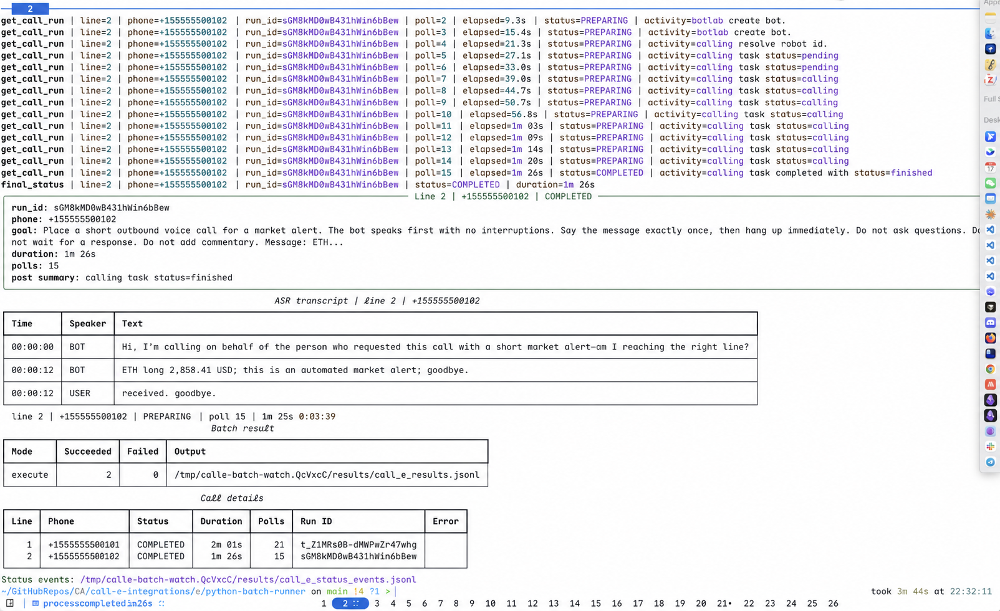

# Python Batch Runner App

This app is a customer-facing Python runner for batch CALL-E MCP tool calls.
It uses the local `calle` CLI login state, reads the CLI token cache, and calls
the remote MCP server with FastMCP.

Run a dry run:

```bash
uv sync
uv run python client.py --input example_market_alerts.jsonl --dry-run
```

Start real outbound calls only when you are ready:

```bash
uv run python client.py --input example_market_alerts.jsonl --execute
```

The script runs these prechecks before processing the JSONL file:

1. Check whether the `calle` CLI is available.
2. If `calle` is missing, install it with `npm install -g @call-e/cli`.
3. Check `calle auth status --json`.
4. If the CLI is not logged in, pause and ask the operator to run
   `calle auth login`, then press Enter to continue.

Input is JSONL. Each line may use the customer payload shape directly:

```json
{"to_phones":["+15555550100"],"region":"US","language":"English","goal":"Place a short outbound voice call for a market alert. Say the following message exactly once, then end the call. Do not ask questions. Do not wait for a response. Do not perform checks or add commentary. Message: ETH, above, 2069.98. This is an automated market alert. Goodbye.","user_input":"Call +15555550100 in English, region US. Deliver this exact market alert and then hang up: ETH, above, 2069.98. This is an automated market alert. Goodbye.","metadata":{"policy_id":"market-alert-call-e-fixed-v3","symbol":"eth","condition":"above","value":2069.98}}
```

Top-level `metadata` is sent as MCP tool-call metadata, not as a `plan_call`
argument. This avoids the `Unexpected keyword argument: metadata` validation
error.

Input fields:

| Field | Where it goes | Meaning |
| --- | --- | --- |
| `to_phones` | `plan_call.arguments` | List of destination phone numbers in E.164 format, for example `["+15555550100"]`. |
| `region` | `plan_call.arguments` | Region hint for the call, for example `US`. |
| `language` | `plan_call.arguments` | Language the call should use, for example `English`. |
| `goal` | `plan_call.arguments` | Full instruction for the call agent. Put the exact message and call behavior here. |
| `user_input` | `plan_call.arguments` | Natural-language user request. This should be the same intent in user-facing wording. |
| `metadata` | MCP tool-call `meta` | Customer/business metadata for tracing and audit. The runner wraps it as `{"call-e/customerMetadata": ...}`. |
| `meta` or `_meta` | MCP tool-call `meta` | Advanced escape hatch when the caller already wants to provide MCP metadata directly. |

Unsupported or extra fields are not sent to `plan_call`. They are listed in the
output record's `ignored_fields`. For this public app, `scheduled_at` and
`ttl_seconds` are intentionally ignored.

Runtime output:



- CLI install uses a Rich spinner while `npm install -g @call-e/cli` runs.
- Login checks print clear pass/fail messages and a login instruction panel when
  `calle auth login` is required.
- Batch execution starts with a Rich input table showing JSONL line, destination
  phone number, region, language, mode, and ignored fields.
- Key events are printed as they happen: `plan_call`, `run_call`,
  `get_call_run`, `final_status`, and `record_failed`. Each event includes the
  JSONL line and destination phone number.
- Execute mode shows elapsed time while polling each run. When a call reaches a
  terminal status, the runner prints a Rich completion panel with run id, elapsed
  duration, server duration when returned, poll count, and post-call summary.
- Terminal results also print an ASR transcript table when the MCP response
  includes transcript, ASR, conversation, messages, turns, or transcript turns.
  Inline transcripts such as `[00:00:00] BOT: ... [00:00:04] USER: ...` are
  split into individual rows. The completion panel and transcript table include
  the destination phone number and task goal for easier debugging.
- Completion prints a batch summary table and a per-call details table with
  line, phone number, final status, duration, poll count, run id, and error type.

Output files:

- `results/call_e_results.jsonl`: one record per input JSONL line. Dry runs
  include `plan_result`. Execute runs include `plan_result`, `run_result`,
  `run_id`, `final_status`, `final_result`, `to_phones`, `started_at`,
  `ended_at`, `duration_seconds`, `server_duration_seconds`, `poll_count`,
  `post_summary`, `transcript`, and `activity`.
- `results/call_e_status_events.jsonl`: execute mode only. Every
  `get_call_run` response is appended as an individual JSONL record, including
  intermediate statuses, elapsed seconds, activity, destination phone numbers,
  and the final terminal status.
- Use `--results-dir`, `--output`, and `--status-output` to change these paths.

`duration_seconds` is measured by this runner from just before `run_call` until
the terminal `get_call_run` status is received. If the server returns its own
duration, it is stored separately as `server_duration_seconds`.

Useful options:

- `--dry-run`: call `plan_call` only and store the result. This is the default.
- `--execute`: call `plan_call`, call `run_call`, then poll `get_call_run`
  until a terminal status is reached.
- `--results-dir`: directory for default output files. Default: `results`.
- `--output`: path for per-input result JSONL.
- `--status-output`: path for `get_call_run` status event JSONL.
- `--poll-interval-seconds`: wait time between `get_call_run` polls. Default:
  `10`.
- `--poll-timeout-seconds`: maximum wait for a terminal status. Default: `900`.
- `--no-login-wait`: fail fast instead of pausing when `calle` is not logged in.
- `--no-auto-install-cli`: fail fast instead of installing the CLI when missing.
- `--calle-command`: use a custom CLI command or path.
- `--server-url`, `--base-url`, `--channel`, `--cache-root`: match the same
  target used by the CLI.

The runner redacts access tokens, refresh tokens, and confirm tokens from Rich
output and result files.
