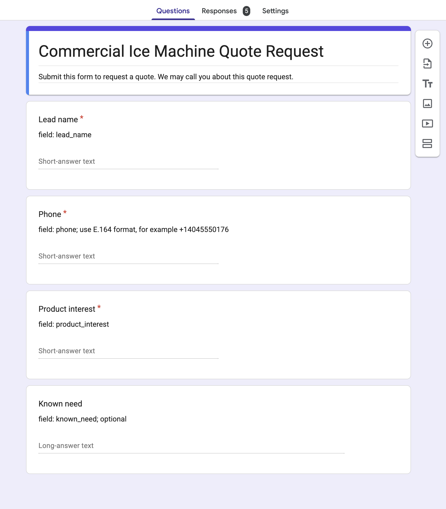
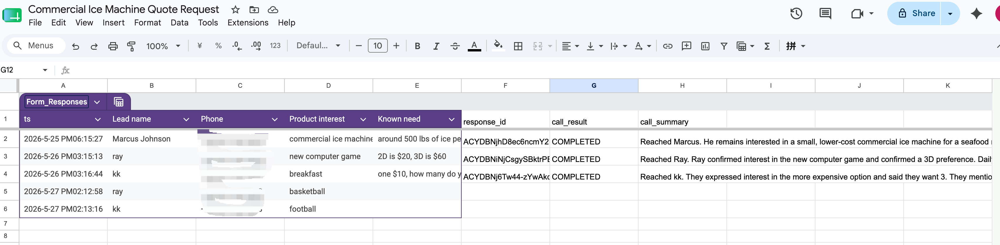
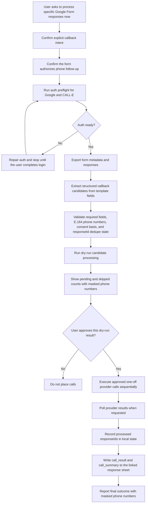
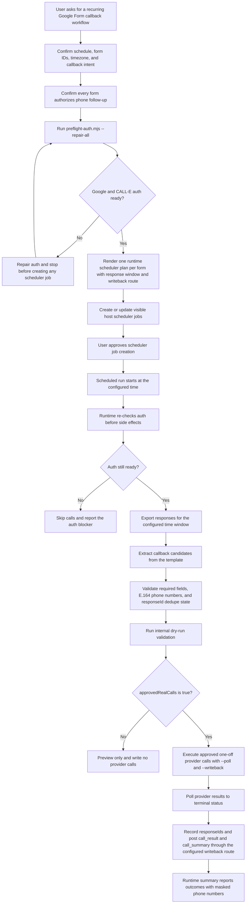

# Google Form Callback Workflow

`google-form-callback` turns authorized Google Form responses into reviewed
one-off AI-agent phone calls. It is designed for lead follow-up, quote request,
appointment callback, and support callback workflows where the form submission
clearly allows a phone follow-up.

The skill keeps responsibilities separated:

- Google Forms and Sheets hold the intake data and result columns.
- The skill exports responses, validates candidates, deduplicates by response
  ID, prepares the call goal, and writes back results.
- CALL-E or another phone-call provider handles exactly one call per approved
  candidate.
- A host scheduler handles recurrence when the workflow is scheduled.

## Demo Form

The reference template builds a commercial ice machine quote request form. The
form asks for a lead name, E.164 phone number, product interest, and optional
known need.



The linked response spreadsheet stores submitted responses and post-call
writeback fields such as call result and call summary.



## Repository Files

| Path | Purpose |
| --- | --- |
| `skills/google-form-callback/SKILL.md` | Agent-facing workflow instructions loaded when the skill is used. |
| `skills/google-form-callback/template.md` | Source of truth for form fields, required fields, output fields, and the call goal template. |
| `skills/google-form-callback/scripts/` | Local OAuth, export, extraction, dry-run, execution, writeback, and schedule-plan helpers. |
| `skills/google-form-callback/references/` | Detailed agent references for API behavior, mapping, safety, runtime prompts, and examples. |
| `forms/callback-request/` | Reference Google Apps Script form creator and fallback export or writeback API files. |
| `docs/google-form-callback/assets/` | Screenshots used by this documentation. |

## Prerequisites

- A Google Cloud OAuth client or the reference Apps Script Web App fallback.
- A Google Form whose description or terms clearly authorize a phone follow-up.
- A linked Google Sheets response spreadsheet for local OAuth writeback.
- CALL-E authentication or another one-off call provider available to the host.
- Phone numbers submitted in E.164 format, for example `+14045550176`.

For local OAuth, authenticate once on the user's machine:

```bash
node skills/google-form-callback/scripts/google-auth.mjs login \
  --credentials ~/.config/google-form-callback/oauth-client.json
```

Before any export, dry-run, scheduled job creation, or real call, check Google
and CALL-E readiness:

```bash
node skills/google-form-callback/scripts/preflight-auth.mjs --repair-all
```

If that command starts browser authorization or prints CALL-E login
instructions, stop setup until the user completes authorization. Continue only
after the preflight command reports success.

## One-Off Callback Flow

Use this flow when the user asks to process specific form responses now. A real
call is placed only after the dry-run output is shown and that exact result is
approved.

The extraction step requires the template to declare
`submissionAuthorizesCallback: true` and requires the exported form description
or template description to clearly mention phone or call follow-up. If that
basis is absent, responses are skipped and no ready call candidates are emitted.



Typical local-OAuth command sequence:

```bash
node skills/google-form-callback/scripts/google-local-api-client.mjs \
  --action export \
  --form-id "FORM_ID" \
  --output form-export.json

node skills/google-form-callback/scripts/extract-callback-candidates.mjs \
  --input form-export.json \
  --template skills/google-form-callback/template.md \
  > candidates.json

node skills/google-form-callback/scripts/process-callback-candidates.mjs \
  --input candidates.json \
  --state callback-state.json \
  --dry-run

node skills/google-form-callback/scripts/process-callback-candidates.mjs \
  --input candidates.json \
  --state callback-state.json \
  --execute \
  --approved-real-calls \
  --poll \
  --writeback callback-writeback.json \
  --writeback-local
```

## Scheduled Callback Flow

Use this flow when the user asks for recurring processing, such as "check this
form every weekday at 9 AM". The host scheduler owns recurrence. The phone-call
provider still receives only one-off call requests during each scheduled run.

The scheduler job approval is the approval for future real calls unless the job
is explicitly configured as preview-only. Scheduled runs still perform an
internal dry-run validation before calling, but they do not ask for another
per-run chat approval when `approvedRealCalls` is true.



Render scheduler plans after auth preflight succeeds:

```bash
node skills/google-form-callback/scripts/render-runtime-plans.mjs \
  --config schedule-config.json
```

The plan renderer expects the config to include form IDs, schedule details, and
`authPreflightOk: true`. It refuses to render real scheduled runtime prompts
without successful preflight because hidden recurring phone-call jobs are not
allowed. For real scheduled calls, `submittedAfter` defaults to the plan render
time when it is not configured, preventing the first scheduled run from calling
old responses. Set `submittedAfter` or `submittedBefore` globally or per form
when the approved schedule should use a specific response window.

Example schedule config:

```json
{
  "schedulePrompt": "Every weekday at 9 AM",
  "timezone": "America/New_York",
  "authPreflightOk": true,
  "approvedRealCalls": true,
  "submittedAfter": "2026-05-27T00:00:00Z",
  "templatePath": "skills/google-form-callback/template.md",
  "stateDir": ".callback-state",
  "writebackDir": ".callback-writeback",
  "runDir": ".callback-runs",
  "writebackLocal": true,
  "forms": [
    {
      "formId": "FORM_ID",
      "name": "Commercial Ice Machine Quote Request"
    }
  ]
}
```

## Google Apps Script Fallback

The preferred route is local OAuth through
`google-local-api-client.mjs`. Use the Apps Script fallback only when the user
has deployed and authorized the reference Web App from `forms/callback-request/`.

Export through the fallback:

```bash
GOOGLE_FORM_CALLBACK_API_TOKEN="same-token" \
node skills/google-form-callback/scripts/google-form-api-client.mjs \
  --url "https://script.google.com/macros/s/.../exec" \
  --action export \
  --form-id "FORM_ID" \
  --output form-export.json
```

Write call results through the fallback:

```bash
GOOGLE_FORM_CALLBACK_API_TOKEN="same-token" \
node skills/google-form-callback/scripts/process-callback-candidates.mjs \
  --input candidates.json \
  --state callback-state.json \
  --execute \
  --approved-real-calls \
  --poll \
  --writeback callback-writeback.json \
  --writeback-url "https://script.google.com/macros/s/.../exec"
```

To retry only sheet writeback without placing another call, use
`--post-writeback callback-writeback.json --writeback-url ...`.

## Safety Boundaries

- Require explicit user intent before processing a form for calls.
- Require the form description or terms to make phone follow-up clear.
- Require E.164 phone numbers. Do not guess or repair ambiguous numbers.
- Mask phone numbers in summaries and logs.
- Deduplicate by Google Forms `responseId` before placing any call.
- Do not expose OAuth tokens, provider credentials, auth callback URLs,
  confirmation tokens, or full private phone numbers.
- Do not create hidden recurring schedules.
- Do not place setup-time test calls unless the user explicitly asks for one.
- For medical, legal, financial, or emergency content, collect logistics or
  route to a human instead of giving advice.

## Useful Commands

| Command | Use |
| --- | --- |
| `node skills/google-form-callback/scripts/google-auth.mjs login --credentials ~/.config/google-form-callback/oauth-client.json` | Start local Google OAuth. |
| `node skills/google-form-callback/scripts/preflight-auth.mjs --repair-all` | Check and repair Google and CALL-E auth before side effects. |
| `node skills/google-form-callback/scripts/google-local-api-client.mjs --action list-forms` | List accessible Google Forms. |
| `node skills/google-form-callback/scripts/google-local-api-client.mjs --action export --form-id "FORM_ID" --output form-export.json` | Export one form and its responses. |
| `node skills/google-form-callback/scripts/extract-callback-candidates.mjs --input form-export.json --template skills/google-form-callback/template.md > candidates.json` | Convert Forms API data to callback candidates. |
| `node skills/google-form-callback/scripts/process-callback-candidates.mjs --input candidates.json --state callback-state.json --dry-run` | Preview pending and skipped candidates. |
| `node skills/google-form-callback/scripts/process-callback-candidates.mjs --input candidates.json --state callback-state.json --execute --approved-real-calls --poll --writeback callback-writeback.json --writeback-local` | Execute approved calls and write results locally. |
| `node skills/google-form-callback/scripts/render-runtime-plans.mjs --config schedule-config.json` | Render host scheduler runtime prompts for recurring workflows. |
